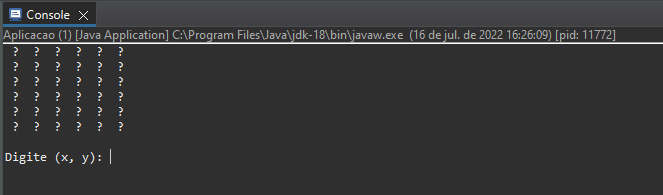
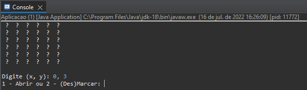
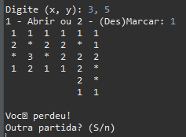
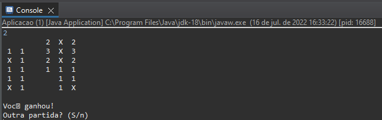

# Projeto Campo Minado  :bomb: :x: :o:
Olá! Este projeto foi baseado no modulo de mesmo nome do curso de Java da COD3R, 
onde teve o intuito de replicar um jogo de campo minado utilizando o console Java.  
<ul><b>Tecnologias utilizadas:</b>
<li> Java 8</li>
<li> API de Streams</li>
<li> Testes Unitários</li>
</ul>
 

## 📖 Explicando o jogo:

O campo minado é um jogo de tabuleiro, onde estão dispostos varios campos (a principio fechados), onde o jogador tem a opção de abrir ou marcar um campo.

Os campos numerados indicam quantas minas estão escondidas nos 8 campos ao seu redor. Com base nos numeros e nos campos que já estão abertos, você deve marcar os campos minados e abrir os seguros. 

O jogo acaba em caso de: Abrir todos os campos seguros e marcar os minados (Vitória) ou do jogador abrir um campo minado e gerar uma explosão (Derrota)

 

## 📐 Arquitetura do Projeto:

O projeto foi construido com base no padrão MVC, onde separei as classes por pacotes de Model e View, há também um pacote usado para a criação de exceções.

 

## ✔️ Testes Unitários:

Utilizando <b>JUnit5</b> houve a implementação de testes unitários para a camada de modelo, onde implementei os testes da classe Tabuleiro (não contemplados no curso).

.drawio.png)

Para realização dos testes foi utilizado o modelo acima como base, onde o primeiro numero indica a linha do campo e o numero a sua coluna.

 

## 🖥️ Resultado Final:

Utilizando o metodo toString() das classes Tabuleiro e Campo, temos a implementação visual no console Java: 

#### Para a execução do jogo, deve-se digitar a linha e coluna do campo que você quer abrir ou marcar.
 

#### Após escolher o campo, deve-se digitar 1 para abrir o campo ou 2 para marca-lo ou desmarca-lo.
 

#### Em caso de explosão de uma mina, o jogador perderá o jogo e terá a opção de reiniciar outra partida.
 

#### Caso o jogador consiga marcar todas as minas e abrir os campos seguros, ele vencerá e terá a opção de reiniciar outra partida.
 

## 📝 Melhorias a serem feitas:
<ul>
  <li>Criação de uma interface grafica.</li>
  <li>Criação de um sistema de pontuação e cronometro.</li>
  <li>Tratamento de todas as possiveis exceções.</li>
</ul>
